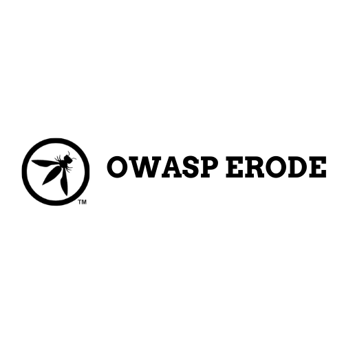

---

layout: col-sidebar
title: OWASP Erode 
tags: Erode
region: Asia
meetup-group: owasp-erode

---

# Welcome

OWASP Erode was started on Feb 2021. We organise Meetings,conferences and workshops on Security and related Technologies.All the events organized by us are open to all and anyone who is interested in joining with us are invited. Join us and grow with us. Knowledge is OPEN-SOURCE.

## For Event Updates
Follow us on twitter and instagram to get instant updates on Upcoming events



Our meetings are open to the public, and you do not need to be a member to attend. Please do consider [joining OWASP](https://owasp.org/membership/) if you find our community, projects, and meetings valuable, or sponsoring this chapter.

## Participation
The Open Web Application Security Project (OWASP) is a nonprofit foundation that works to improve the security of software. All of our projects ,tools, documents, forums, and chapters are free and open to anyone interested in improving application security. 

Chapters are led by local leaders in accordance with the Chapter Policy. Financial contributions should only be made online using the authorized online donation button. To be a SPEAKER at ANY OWASP Chapter in the world simply review the [speaker agreement](/www-policy/speaker-agreement) and then contact the local chapter leader with details of what OWASP Project, independent research, or related software security topic you would like to present.

Everyone is welcome and encouraged to participate in our [Projects](/projects), [Local Chapters](/chapters), [Events](/events). We especially encourage diversity in all our initiatives. OWASP is a fantastic place to learn about application security, to network, and even to build your reputation as an expert. We also encourage you to be [become a member](/membership) or consider a [donation](/donate) to support our ongoing work.

## Speakers
If you like to join our event as a speaker on our upcoming events, Kindly mail us on
* [Sachin S](mailto:sachin.selvaraju@owasp.org)
* [Abhinivesh S](mailto:abhi.nivesh@owasp.org)

**Email Format :**

- Speaker name
- Job Role
- Company / Organization
- Country
- Email ID
- Contact Number
- Speaker Profile
- Presentation Details
    - Name / Title of the Presentation
    - Abstract of the presentation
    - Presentation time required

## Local News
- Meeting Location - Erode
- Everyone is welcome to join us at our chapter meetings.
- Inauguration Event of OWASP Erode on 13th March 2021 , 6PM IST 

##  Events Conducted

Event Date | Event Mode | Time | Topic | Speaker
--- | --- | --- | --- |---
13 March 2021 | On-line | 6:00PM IST | How to get started in Bug Bounty? | Sandeep Srinivasan
17 April 2021 | On-line | 5:00PM IST | Learn to Hack Through CTFs | Sachin, Abhinivesh
30 May 2021 | On-line | 5:00PM IST | Intro to SQL Injection | Monish Kumar
27 June 2021 | On-line | 5:00PM IST | Getting Started in Android Security | Abhinivesh S 

## Upcoming Events
Getting Started in Android Security by 
Abhinivesh S
Topics covered:

1. How Android works.
2. Android security fundamentals.
3. System security vs application security.

Session Duration: 1hour
Meet link: https://meet.google.com/rgt-xkjk-mxr
    

## To Join OWASP Erode

- Mail us to [OWASP Admin](mailto:sachin.selvaraju@owasp.org)
